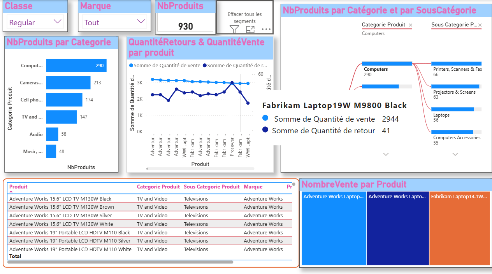
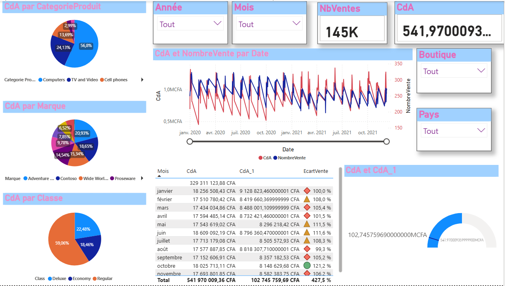

# 📊 Power BI Sales Dashboard  

Analyse des ventes à travers un dashboard interactif construit avec **Power BI, DAX, Power Query**.  
Ce projet illustre mes compétences en **data cleaning, modélisation, création de KPIs et storytelling visuel**.  

---

## 🔹 Fonctionnalités principales  
- Analyse de **306 boutiques** et **930 produits** répartis en plusieurs catégories.  
- Visualisation interactive par **continent, pays, boutique, catégorie et sous-catégorie de produit**.  
- Suivi des **ventes, remises et performances par produit/marque**.  
- KPIs dynamiques : **Chiffre d’Affaires (CdA)**, **Nombre de ventes**, **Écart de performance**.  

---

## 🔹 Technologies utilisées  
- **Power BI** (dashboards, visuels, filtres dynamiques)  
- **DAX** (mesures & KPIs personnalisés)  
- **Power Query** (nettoyage & préparation des données)  
- **Excel** (exploration initiale des données)  

---

## 🔹 Aperçu du Dashboard  

### 🛒 Vue Produits  
Répartition des produits par **catégorie et sous-catégorie**, suivi des ventes et retours.  
  

### 💰 Vue Ventes & KPIs  
Suivi du **chiffre d’affaires**, des **ventes mensuelles** et analyse des performances par **classe et marque**.  
  

---

## 🔹 Structure du projet  
```
powerbi-sales-dashboard/
│── README.md
│── Sales_Dashboard.pbix
│── Produits.png
│── Ventes.png
```

---

## 🔹 Résultats clés  
- 📈 **541M+ CFA** de chiffre d’affaires total analysés.  
- 🏬 **306 boutiques** étudiées (dont 96% actives).  
- 🎯 Mise en évidence des **catégories les plus performantes** : Computers (56%), TV & Video (24%).  

---

👉 Ce projet démontre ma capacité à transformer des données brutes en insights business exploitables via des **dashboards interactifs Power BI**.  
